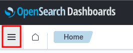
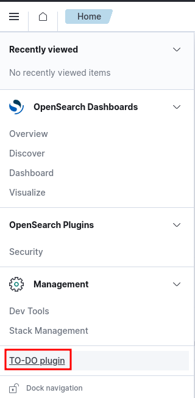
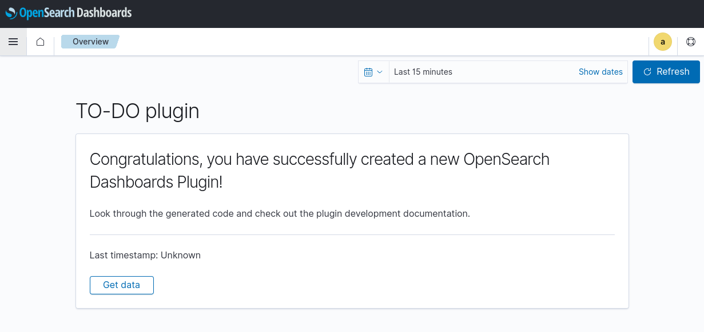

# Setup the development environment

## Requirements

The developer environment is defined through a `docker-compose.yml` file.

To deploy it, you need:

- Docker desktop https://www.docker.com/products/docker-desktop/

or

- Docker engine https://docs.docker.com/engine/
- docker-compose standalone https://docs.docker.com/compose/install/other/ 
> The recent versions of `docker` CLI has a built-in `compose` command that is similar to the
> `docker-compose` standalone. If your `docker` CLI thas the builtin-in `compose` command, you don't
> need to install it. See the help of your `docker` CLI using:
> ```shell
> docker --help
> ```

## Virtual memory

The provided development environment need to increase the virtual memory limit.

On Linux, you can increase the limits by running the following command as **root**:

```shell
sysctl -w vm.max_map_count=262144
```

## Development environment

The `docker-compose.yml` file defines the development environment that has the
following services:

- **os1**: OpenSearch node v2.4.1
- **osd**: OpenSearch Dashboards v2.4.1 (development mode)
> The **osd** service maps a container port to the Docker host on port `5601`.
> This has the following volumes mount:
> - configuration for the OpenSearch Dashboards server. **You should not touch this file.**
> - source code of a barebone plugin. This is the `src` directory that is mounted in
>   `/home/node/kbn/plugins/custom_plugin` path inside the container.

### Start the enviroment

Before starting the environment, ensure the Docker host has not busy the port `5601`
or change the configuration in the `docker-compose.yml` file to another host port.
```yml
# docker-compose.yml
- ports
  - 5601:5601
```
The first number in `5601:5601` statement is the port in the Docker host. You could change it if
this is busy in your Docker host.

Start the development environment from the path where the `docker-compose.yml` file is located:

- Using the `docker` CLI 

```shell
docker compose up -d
```

Output:     
```
[+] Running 3/3
 ⠿ Network dev_environment_default  Created                                 0.0s
 ⠿ Container dev_environment-os1-1  Healthy                                12.4s
 ⠿ Container dev_environment-osd-1  Started                                12.7s
```

Check that you have the containers running:

```shell
docker compose ps
```

Output:
```
NAME                    COMMAND                  SERVICE             STATUS              PORTS
dev_environment-os1-1   "./opensearch-docker…"   os1                 running (healthy)   9200/tcp, 9300/tcp, 9600/tcp, 9650/tcp
dev_environment-osd-1   "tail -f /dev/null"      osd                 running             0.0.0.0:5601->5601/tcp, :::5601->5601/tcp
```

- Using the `docker-compose` standalone

```shell
docker-compose up -d
```

```
[+] Running 3/3
 ⠿ Network dev_environment_default  Created                                 0.0s
 ⠿ Container dev_environment-os1-1  Healthy                                12.4s
 ⠿ Container dev_environment-osd-1  Started                                12.7s
```

Check that you have the containers running:

```shell
docker-compose ps
```

Output:
```
NAME                    COMMAND                  SERVICE             STATUS              PORTS
dev_environment-os1-1   "./opensearch-docker…"   os1                 running (healthy)   9200/tcp, 9300/tcp, 9600/tcp, 9650/tcp
dev_environment-osd-1   "tail -f /dev/null"      osd                 running             0.0.0.0:5601->5601/tcp, :::5601->5601/tcp
```

### Start and manage the OpenSearch Dashboards server

The development OpenSearch Dashboards container doesn't start the server.

Access to the container and run the following command from `/home/node/kbn` path:

```shell
yarn start --no-base-path
```

Output:
```
yarn run v1.22.19
$ node scripts/opensearch_dashboards --dev --no-base-path
  log   [10:40:58.819] [info][plugins-service] Plugin "dataSourceManagement" has been disabled since the following direct or transitive dependencies are missing or disabled: [dataSource]
  log   [10:40:58.824] [info][plugins-service] Plugin "dataSource" is disabled.
  log   [10:40:58.824] [info][plugins-service] Plugin "visTypeXy" is disabled.
  log   [10:40:58.982] [info][plugins-service] Plugin initialization disabled.
  log   [10:40:58.995] [warning][savedobjects-service] Skipping Saved Object migrations on startup. Note: Individual documents will still be migrated when read or written.
np bld    log   [10:41:00.496] [info][@osd/optimizer] initialized, 0 bundles cached
np bld    log   [10:41:00.497] [warning][@osd/optimizer] only building [v7dark,v7light] themes, customize with the OSD_OPTIMIZER_THEMES environment variable
 watching for changes  (2134 files)
np bld    log   [10:41:01.204] [info][@osd/optimizer] starting worker [13 bundles]
np bld    log   [10:41:01.205] [info][@osd/optimizer] starting worker [13 bundles]
np bld    log   [10:41:01.206] [info][@osd/optimizer] starting worker [12 bundles]
np bld    log   [10:41:01.209] [info][@osd/optimizer] starting worker [13 bundles]
server    log   [10:41:04.873] [info][plugins-service] Plugin "dataSourceManagement" has been disabled since the following direct or transitive dependencies are missing or disabled: [dataSource]
server    log   [10:41:04.880] [info][plugins-service] Plugin "dataSource" is disabled.
server    log   [10:41:04.881] [info][plugins-service] Plugin "visTypeXy" is disabled.
server    log   [10:41:05.115] [info][plugins-system] Setting up [39] plugins: [usageCollection,opensearchDashboardsUsageCollection,opensearchDashboardsLegacy,mapsLegacy,share,opensearchUiShared,legacyExport,embeddable,expressions,data,home,console,apmOss,management,indexPatternManagement,advancedSettings,savedObjects,dashboard,visualizations,visTypeTimeline,timeline,visTypeTable,visTypeVega,visTypeMarkdown,visBuilder,tileMap,regionMap,inputControlVis,visualize,customPlugin,charts,visTypeVislib,visTypeTagcloud,visTypeTimeseries,visTypeMetric,discover,savedObjectsManagement,securityDashboards,bfetch]
server    log   [10:41:08.972] [info][savedobjects-service] Waiting until all OpenSearch nodes are compatible with OpenSearch Dashboards before starting saved objects migrations...
server    log   [10:41:09.058] [info][savedobjects-service] Starting saved objects migrations
server    log   [10:41:09.112] [info][savedobjects-service] Creating index .kibana_1.
server    log   [10:41:09.362] [info][savedobjects-service] Pointing alias .kibana to .kibana_1.
server    log   [10:41:09.454] [info][savedobjects-service] Finished in 350ms.
server    log   [10:41:09.483] [info][plugins-system] Starting [39] plugins: [usageCollection,opensearchDashboardsUsageCollection,opensearchDashboardsLegacy,mapsLegacy,share,opensearchUiShared,legacyExport,embeddable,expressions,data,home,console,apmOss,management,indexPatternManagement,advancedSettings,savedObjects,dashboard,visualizations,visTypeTimeline,timeline,visTypeTable,visTypeVega,visTypeMarkdown,visBuilder,tileMap,regionMap,inputControlVis,visualize,customPlugin,charts,visTypeVislib,visTypeTagcloud,visTypeTimeseries,visTypeMetric,discover,savedObjectsManagement,securityDashboards,bfetch]
server    log   [10:41:11.325] [info][listening] Server running at http://0.0.0.0:5601
server    log   [10:41:11.495] [info][server][OpenSearchDashboards][http] http server running at http://0.0.0.0:5601
np bld    log   [10:42:10.955] [success][@osd/optimizer] 51 bundles compiled successfully after 70.9 sec, watching for changes
```

The server is ready when you see the following log:

```
server    log   [12:40:34.503] [info][server][OpenSearchDashboards][http] http server running at http://0.0.0.0:5601
```

In the first run, the frontend code have to be optimized. This can take some minutes. You should see a
log as:
```
np bld    log   [10:42:10.955] [success][@osd/optimizer] 51 bundles compiled successfully after 70.9 sec, watching for changes
```

If you need to stop the server process, use **CTRL+C** in the console where the process is running.

### Access the OpenSearch Dashboards web UI

You can access to the server through your browser in http://localhost:5601 (5601 is the default port
in the environment configuration).

Credentials to login in the UI (http://localhost:5601) are:

```
username: admin
password: admin
```

If you access to the web of OpenSearch Dashboards and see the next:


the problem could be caused because the frontend-side code was not yet optimized. In this case, you
should wait until the optimization finishes.

### Stop the enviroment

- Using the `docker` CLI

```shell
docker compose stop
```

- Using the `docker-compose` standalone

```shell
docker-compose stop
```

### Destroy the enviroment

- Using the `docker` CLI

```shell
docker compose down
```

- Using the `docker-compose` standalone

```shell
docker-compose down
```

### Summary - Manage the development environment

- `docker` CLI

| Action          | Command              |
| ---             | ---                  |
| Start           | docker compose up -d |
| Stop            | docker compose stop  |
| Stop and remove | docker compose down  |

- `docker-compose` standalone

| Action          | Command              |
| ---             | ---                  |
| Start           | docker-compose up -d |
| Stop            | docker-compose stop  |
| Stop and remove | docker-compose down  |

# Access to the UI of the custom plugin

With the OpenSearch Dashboards server running, access to the server through the browser.

Open the menu:



Click on the custom plugin:



Custom plugin overview:



## Developer notes

If you used the provided command to start the OpenSearch Dashboards server, then while it is running:
- any server-side change causes the server to restart.
- any frontend-side change causes the code to be optimized and the static files are updated.
  This process can take some time when you do the first change after starting the server,
  because a worker process is initiated.

  When the frontend files are optimized you should see a log as:
  > np bld    log   [10:47:08.306] [success][@osd/optimizer] 1 bundles compiled successfully after 0.1 sec, watching for changes

### Frontend cache

The browser can cache the frontend files. It is recommended to **disable the cache** while you are
developing the frontend. 

You can do this through a checkbox in the browser development tools.
> ⚠️ This only works if the browser development tools are opened. So you need to keep them opened while you want
to see the changes done in the frontend.

- Google Chrome


- Firefox


### Plugin dependencies

The plugins can access some dependencies of the OpenSearch Dashboards.

If you needs a new dependency, ensure this is not included in the OpenSearch Dashboards. Check the
`package.json` of the OpenSearch Dashboards. Inside the development container, check the
`/home/node/kbn/package.json` file.

### Installing a new plugin dependency

In the case you need to install a new dependency for the plugin. Follow the next steps:

0. Start the development server, access to the container that is running the OpenSearch Dashboards
  (**osd**) service and ensure the OpenSearch Dashboards server process is stopped.

1. Go to the plugin directory inside the container
```shell
cd /home/node/kbn/plugins/custom_plugin
```
2. Install the dependency through `yarn` (preferable) or `npm`. Both are availables.

- Using `yarn`:

```shell
yarn add <dependency_name>
```

- Using `npm`:

```shell
npm install <dependency_name>
```

> replace `<dependency_name>` by the name of the dependency you want to install

The plugin dependency will be installed.

# References:

- Docker desktop https://www.docker.com/products/docker-desktop/
- Developing inside a container https://code.visualstudio.com/docs/devcontainers/containers
- OpenSearch https://opensearch.org/docs/2.4/about/
- OpenSearch plugins https://opensearch.org/blog/dashboards-plugins-intro/
- UI library - public documentation @elastic/eui https://eui.elastic.co/v34.6.0/#/
> OpenSearch Dashboards uses [@opensearch-project/oui](https://github.com/opensearch-project/oui)
> that is a fork of [@elastic/eui](https://github.com/elastic/eui), the provided link is pointing to
> the documentation of @elastic/eui that was forked. This means the documentation could not't apply
> totally to the UI library used in the provided OpenSearch Dashboards (@opensearch-project/oui)
- UI library - @opensearch-project/oui repository (1.0.0) https://github.com/opensearch-project/oui/tree/1.0.0
- Jest testing framework https://jestjs.io/