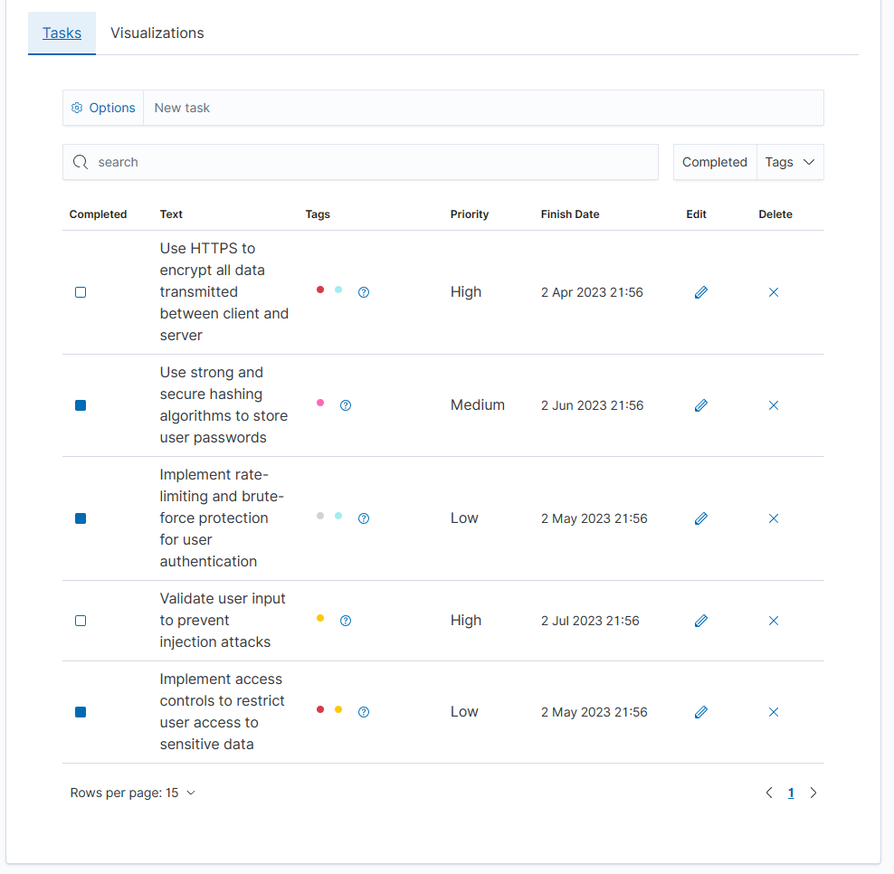
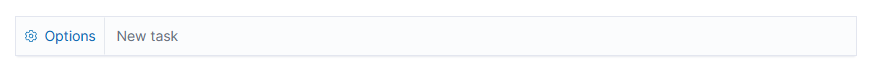
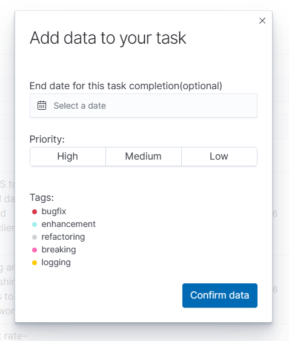
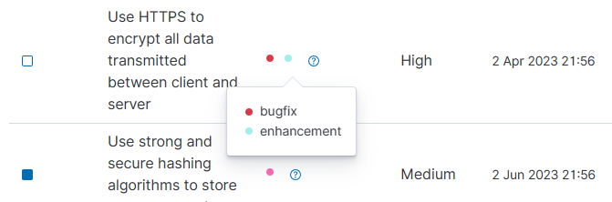
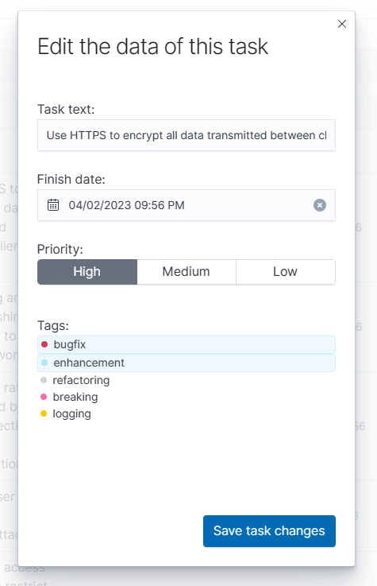
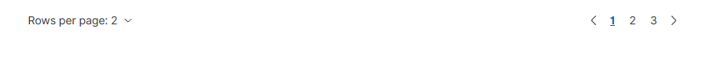
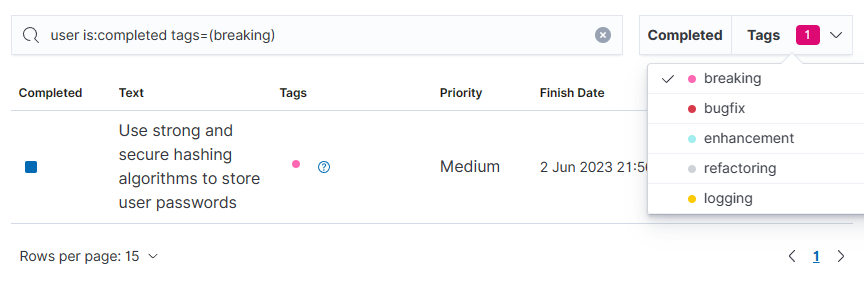
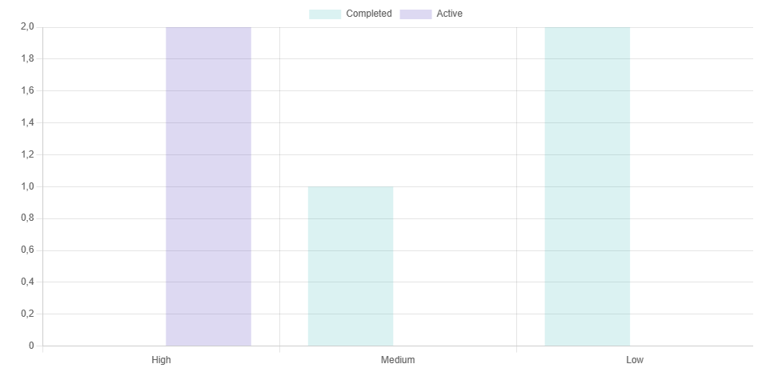
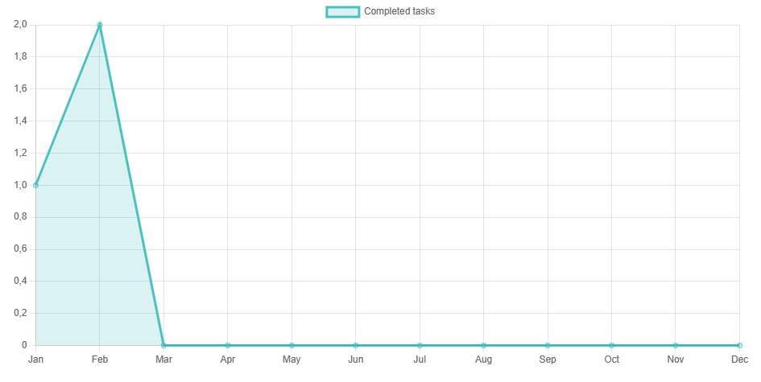
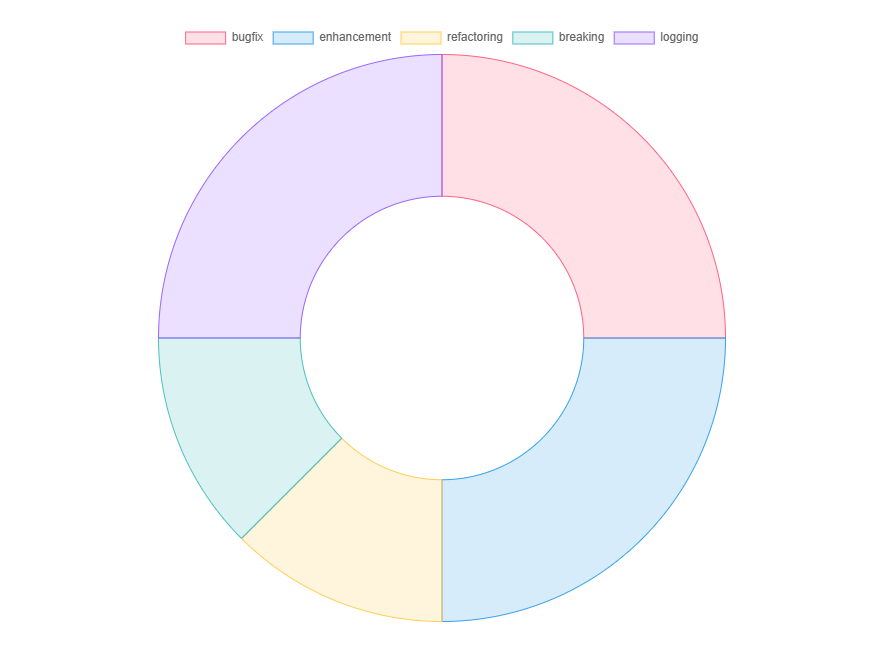

# Start with the project
1.Install all the dependencies in the ./src folder of this project using the command yarn:
```shell
yarn
```

2.Run project
```shell
yarn start --no-base-path
```
# Folder structure

* **public/components** folder has every components use in the plugin.
* **public/hooks** contains useHttpActions, to connect request functions with several components in the plugin.
* **public/constants.ts** has some constants used in the plugin, in this case, *TAGS* object.
* **public/context.ts** provides http and notifications core utitities along the aplication, avoiding prop drilling.
* **public/store.ts** has the global state, managed by *zustand*.
* **public/types.ts** exports multiple interfaces.
* **server/routes** has the endpoints to connect the frontend with the data.

# Run tests
To run tests:
1. Access to container dev_environment-osd-1.

2. Go to the plugin directory:
```shell
cd /home/node/kbn/plugins/custom_plugin
```

3. run:
```shell
yarn test
```

Tests files are in their corresponding component folder.

# UI Usage

## Tasks View
### Tasks basics
* An initial run of the plugin will create a 'todos' index in Opensearch, and it'll fill it with some sample tasks:


* To create a new task, you should use the "new task" text input:


* In the options button, you'll open a modal with the rest of the data that you can add to a task:

You can set the date to finish the task, the priority of this task, and some tags.
After confirm, in the text input, write the text of the task and press key "enter".
You'll see a notification.

* In each row there is a blue checkbox, clicking in it will update the completed state of the task.

* The tags columns have a color code for them, you can click it to see the complete information as well:


* Clicking the pencil button will display a modal for edit the selected task, it works like the creation task modal:


* The delete button will delete the selected task.

* On the bottom of the table there is the pagination:

It is possible to change the amount of elements displayed in each page.

* The header of the columns are clickable, they will sort by its column, for example: show completed first.

### Search and filtering

* On the top of the table there is a search bar, with some options. You can write text to filter by the text field of the tasks, filter if they are completed, or by tag.


## Visualizations View
In this tab there are some charts with information about the tasks
* Priority bar chart:

Shows Completed and Active tasks by priority.
* Completed task line chart:

Shows Completed tasks over time.
* Tags distribution

Shows tag distribution.


